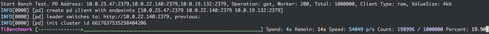
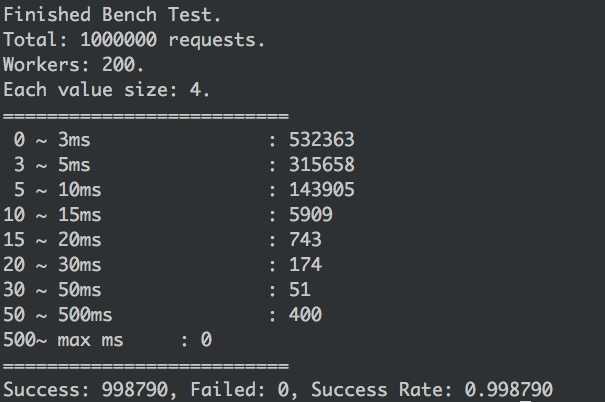

# Tikv-bench-tool

The missing TiKV benchmark command line tool. It ONLY support GET and SET Operation now. It can test `raw` or `transaction` client.





```
Usage:
    tibench [--pd-addr=<pd_addr>] [--op=<op>] [--total=<total>] [--worker=<worker_number>] [--data-size=<data_size>] [--client-type=<client_type>]
    tibench --help
    tibench --version

Options:
    --help                                          Show the help info
    --version                                       Show the bench tool version
    --pd-addr=<pd_addr>                             The PD(placement driver) server address, split by comma.
    --op=<op>                                       The tikv op to do benchtest.
    --total=<total>                                 The total request count.
    -w <worker_number>, --worker=<worker_number>    The number of the concurrent workers.
    --data-size=<data_size>                         The value data size(KB).
    --client-type=<client_type>                     The tikv client type, only "raw" or "trans".
```
